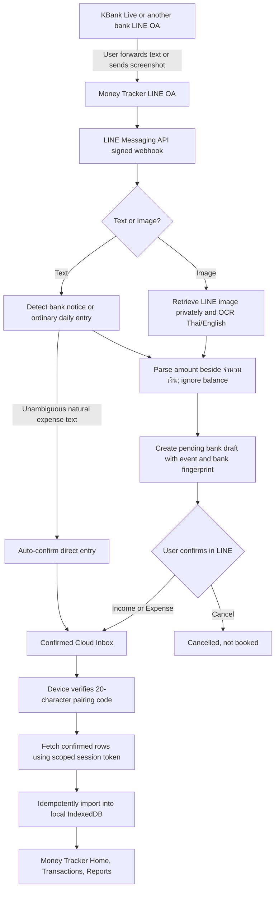

# LINE Forward → Money Tracker — Implementation Guide

## What is built on this feature branch

This is a **staging-only implementation**. There are no active LINE credentials or dedicated Money Tracker Supabase database yet.

## Examples

| Forwarded message | Extracted result | Safety |
|---|---|---|
| KBank Live screenshot of 9 Oct 2569, transfer -119.00, balance 400070.79 | expense 119.00 THB, date 2026-10-09 | Bank balance is **never** used as transaction amount. Explicit LINE review required |
| Direct LINE chat: กาแฟ 65 | expense 65.00, food | Auto-add only when there is one clear amount |
| Direct LINE chat: รับ 5000 งานเสริม | income 5000.00, side income | Auto-add only when direction is unambiguous |
| Two amounts in plain text with no identifiable bank amount label | No entry | Must clarify, never guess |

Supported image input: a **user-sent JPEG/PNG/WEBP screenshot** on the Money Tracker OA. LINE's message-content API cannot read a different OA's historical messages. The user must forward text or send a screenshot into the Money Tracker OA. Some LINE OA card layouts cannot be forwarded directly; screenshot is the fallback.

## LINE chat confirmation

For a bank notice, the bot does NOT book the event immediately. It creates a server-side pending record and replies:

- บันทึกเป็นรายจ่าย (postback)
- บันทึกเป็นรายรับ (postback)
- ไม่บันทึก (postback)

Only a signed postback from the same LINE account can change a pending record to confirmed or cancelled. Once confirmed, it becomes eligible for syncing to Money Tracker. The source bank screenshot is **not saved** in the database.

## Connect user to browser securely

1. User sends **/เชื่อม** in a direct chat with the Money Tracker OA.
2. Bot issues an unguessable 20-hex-character code that expires in 5 minutes.
3. User opens Money Tracker → **ตั้งค่า** → **LINE → เงินวันนี้** and pastes code.
4. Vercel's server endpoint exchanges the code for a random 256-bit device token. Only the SHA-256 hash of that token is stored in Supabase.
5. Browser requests the confirmed inbox over HTTPS from the scoped public bridge host. The origin must match the configured Money Tracker site.
6. Imported rows get stable IDs in IndexedDB; seen rows are remembered to prevent repeated imports after local deletion.
7. App automatically syncs on load and when brought back into the foreground. An explicit sync button also exists in Settings.

**Limitations:** This is one-way **LINE → browser** sync, not full multi-device cloud bookkeeping. Manually added/edited records remain local. Unlinking locally revokes the device's saved token; send **/ยกเลิกเชื่อม** to the OA to revoke the cloud session. Reissuing a pairing code revokes the previous device session. Only up to 500 newest confirmed LINE records are fetched in one sync.

## Needed before live launch

**LINE provider**
- Create or provide Money Tracker LINE Official Account with Messaging API enabled.
- Add the official-account Channel Secret and Channel Access Token as secret env vars, **not in this chat**.
- Configure the public webhook URL and enable redelivery.
- Allowlist the permitted LINE user IDs at launch.

**Supabase**
- Approve a **new dedicated Money Tracker Supabase project**. None exists currently. Do NOT apply this migration to unrelated UTP or other databases.
- Apply `supabase/migrations/20261010000000_line_inbox.sql` and test service-role access and RLS.
- Configure server-only SUPABASE_URL and SUPABASE_SERVICE_ROLE_KEY.

**Vercel**
- Existing Money Tracker app has Vercel SSO Protection enabled for vercel.app domains. Do **not** switch off app-wide protection.
- Deploy the server routes to a separate, publicly reachable bridge host with valid webhook HMAC, sender allowlist and strict CORS.
- Environment variables on the bridge: LINE_CHANNEL_SECRET, LINE_CHANNEL_ACCESS_TOKEN, LINE_ALLOWED_USER_IDS, SUPABASE_URL, SUPABASE_SERVICE_ROLE_KEY and LINE_ALLOWED_APP_ORIGIN (e.g. https://money-tracker-beta-teal.vercel.app).
- On Money Tracker frontend, configure **VITE_LINE_BRIDGE_URL** to the public HTTPS bridge host. This URL is public and is not a secret.
- Avoid broad, unauthenticated database endpoints. Service-role keys NEVER go to browser code.

## Release gates

1. Unit parser tests, bank notice tests, signed webhook and postback tests, TypeScript and production build.
2. Real bank screenshots on LINE OA via LINE Messaging API. Verify image download, Thai OCR model availability, reply-token timing, unknown-image handling and transaction confirmation.
3. Forged signature -> 403. Unknown sender -> ignored. Missing credentials -> 503. Failed storage -> 503. Duplicate webhook ID and repeated bank notice fingerprint -> no double-booking.
4. Expired pairing code, one-time claim, session revocation, origin CORS deny, and database RLS negative tests.
5. Import into IndexedDB, app balance/reports update, offline/resume, local backup and preserve existing user records.
6. Browser Audit mobile 320/375/390/430, tablet 768, desktop 1280, and on-device iPhone Safari and LINE in-app browser.
7. Production rollout only after these gates and owner-approved infrastructure/credentials.

## Reference documentation

- https://developers.line.biz/en/docs/messaging-api/receiving-messages/
- https://developers.line.biz/en/docs/messaging-api/verify-webhook-signature/
- https://developers.line.biz/en/reference/messaging-api/
- https://vercel.com/docs/functions/configuring-functions/duration
